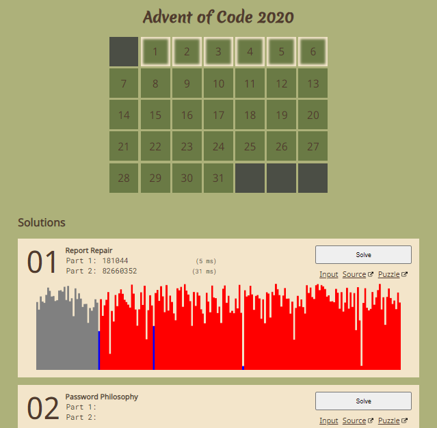

  
  
# aoc2020

Solutions for the Advent of Code 2020 coding challenge calendar.  
Includes an angular solution runner available at: [sanraith.github.io/aoc2020](https://sanraith.github.io/aoc2020).

## Local repository setup

Run `git clone https://github.com/sanraith/aoc2020` to clone the repository.  
Run `npm install` to download dependencies.

## Running solutions

Run `npm start` or `npm start -- --all` to solve all days.  
Run `npm start -- --day 2 3` to solve day 2 and 3.  
Run `npm start -- --last` to solve the last available day.  
Run `npm start -- --help` to display all available options.

## Debugging

Visual Studio Code configuration is set up to attach to the latest solution on debug.  
You can also run `npm run dev` to start a nodemon process for the latest solution.

## Scaffolding

Provide your session key in `/util/session.json` if you want to fetch puzzle title and input from [adventofcode.com](https://adventofcode.com).

```json
{
    "sessionKey": "YOUR_SESSION_KEY_HERE"
}
```

Run `npm run scaffold` to scaffold code for the next available day.  
Run `npm run scaffold -- 11` to scaffold code for the day 11.  
Run `npm run scaffold -- 2 3 4 --year 2019` to scaffold code for the day 2, 3 and 4 from Advent of Code year 2019.  
Run `npm run scaffold -- --help` to display all available options.

## Deploy to github pages

Update the `baseHref` variable in `util/deploy.ts` for your own deploy target.  
Run `npm run deploy`. The webpage will be deployed to `docs/`.

## Attributions

Icons made by [Dave Gandy](https://www.flaticon.com/authors/dave-gandy) from [www.flaticon.com](https://www.flaticon.com/).
